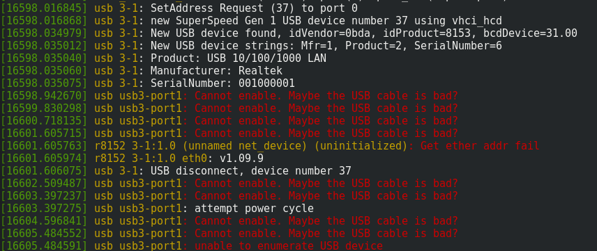

= Limited support for ethernet/wifi USB adapters

In a QubesOS configuration using two distinct VMs for handling USB and network (aka sys-usb and sys-net respectively), beware not all ethernet/wifi USB adapters are supported when you attach them to another VM than the USB one (aka sys-usb).

When attaching the USB adapter with following command issued in dom0: `qvm-usb attach sys-net sys-usb:XXXX` (where XXXX represent the device ID retrieved from `qvm-usb`)
then you can see ouput below from dmesg in sys-net: `sudo dmesg`:

More details at with some working USB adapters at: https://github.com/QubesOS/qubes-issues/issues/3778.
